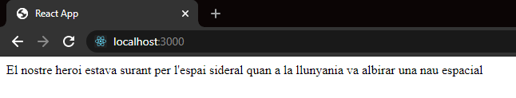
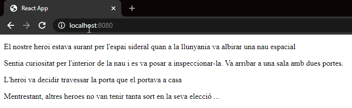
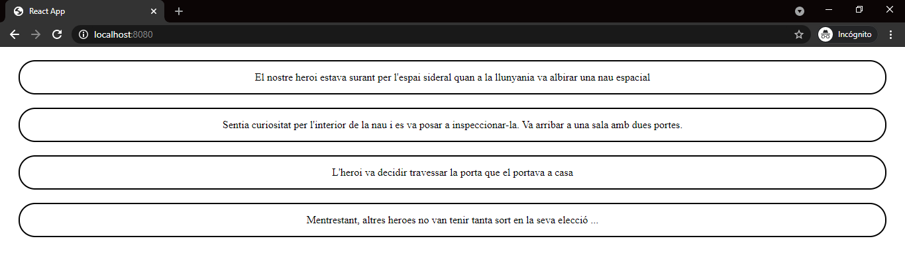
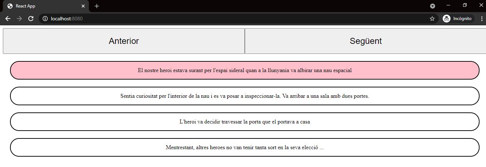

# Sprint 6. Vue I

##### Sumari

- Objectius

- Part teòrica
  
  - Primers passos en Vue
  
  - Curs Vue, part 1

- Part pràctica

---

## OBJECTIUS

**ENHORABONA!! Ja estàs a Vue!** Això vol dir que has après JavaScript, el llenguatge que utilitzaràs amb la llibreria Vue per tal de desenvolupar els teus projectes amb més rapidesa.

En aquest sprint has de donar el 200% per així conèixer i entendre tots els conceptes fonamentals, ja que són la base principal d'aquesta llibreria. D'altra banda, t'avisem que trobaràs alguns recursos que provenen de Vue 2 i Vue 3, no t'amoïnis, creiem que és necessari que progressivament comencis a conèixer recursos més avançats, pel fet que presenten diverses similituds conceptuals entre ells.

###### **Durada de l'sprint**

15 dies lectius.

###### **Objectius generals**

- Aprendre conceptes bàsics de Vue i crear els nostres primers projectes.

###### **Objectius específics**

- Entendre com s'estructura i funciona Vue.

- Començar els projectes amb Vue, bé usant un **cdn, vue-cli o Vite.**

- Crear els nostres primers components.

- Saber declarar variables, mètodes i variables computades en un component de Vue.

- Aprendre les directives de Vue.

- Passar dades entre els components, amb props i esdeveniments.

- Aprendre a cridar mètodes des de la template amb @click.

- Aprendre a utilitzar els filtres de Vue.

----

## PART TEÒRICA

### PRIMERS PASSOS AMB VUE

Com s'ha comentat en la descripció de l'sprint, en aquest curs trobaràs vídeos de Vue2 i Vue3. No et preocupis, són molt similars.

De fet, pot ser fins i tot convenient que aprenguis Vue2, ja que moltes llibreries encara no són compatibles amb Vue3.

Aquest vídeo et mostrarà els passos necessaris per dur a terme la creació de projectes amb Vue. Veuràs que és molt ràpid i senzill d'aplicar.

[Cómo empezar con Vue.js | Primeros pasos con Vue - YouTube](https://www.youtube.com/watch?v=L0F4OPPsm0c)

#### Instal·lar node.js

[Node JS Installation - YouTube](https://www.youtube.com/watch?v=JINE4D0Syqw)

En molts tutorials s'utilitza **yarn** per instal·lar paquets en lloc de **npm.**

Et recomanen que te l'instal·lis ara, ja que sovint l'hauràs d'utilitzar:

[How to Install Yarn | Yarn Package Manager - YouTube](https://www.youtube.com/watch?v=pyvurlqIMMM)

#### Vue CLI

"Vue-cli" (és a dir, la “interfície de línia de comandos Vue”) és una eina creada per l'equip Vue.js que permet desenvolupar amb més rapidesa les aplicacions Vue.

La interfície de línia de comandos de Vue ens proporciona iniciar de manera immediata, per tant, no serà necessari que et preocupis per la resta d'eines diferents.

De moment només hauràs de saber dues coses importants de Vue-cli: instal·lar-ho i saber utilitzar-lo amb la finalitat de crear projectes.

A continuació, disposaràs d'una documentació molt senzilla:

**-> [Documentació per a instal·lar Vue-cli](https://cli.vuejs.org/guide/installation.html)**

**-> [Documentació per a crear un projecte amb Vue-cli](https://cli.vuejs.org/guide/creating-a-project.html)**

#### Extensions VSCode

A continuació, en el següent vídeo, t'explica les millors extensions de **Visual Code,** que et seran de gran utilitat quan programis una aplicació web amb Vue:

[Vue &amp; las mejores extensiones para Visual Studio Code. Vue Español. - YouTube](https://www.youtube.com/watch?v=VHqdbXAOiGg)

#### Generar primer projecte Vue amb Vite

Pots generar la base del teu projecte Vue fàcilment per comandos, també pots utilitzar Vite (no només Vue-cli):

[Creating Your First Vue 3 App with Vite - A Beginner&#39;s Tutorial - YouTube](https://www.youtube.com/watch?v=JLt3GrDZDvQ)

### Curs Vue, part 1

En aquest curs s'expliquen els conceptes fonamentals de **Vue** per poder començar a utilitzar-ho.

És molt important que sàpigues llegir documentació de la tecnologia que fas servir. Per això, després d'aprendre un concepte nou en cada apartat d'aquest curs, et recomanem repassar aquest concepte, en aquest enllaç **->[documentació oficial de Vue](https://v3.vuejs.org/guide/introduction.html#what-is-vue-js)**.

A més, la documentació oficial de Vue està molt ben estructurada, amb explicacions molt clares i concises!

#### Consells per aprendre a programar

Abans de començar amb Vue, convé fer una aturada i reflexionar sobre aquests consells per aprendre a programar.

El més important: **no utilitzis sempre el mateix recurs d'aprenentatge (mateixa plataforma)** perquè internet és molt ampli i ofereix possibilitats per adquirir més coneixement. Aprofita aquests avantatges per conèixer diferents alternatives que poden ajudar-te a progressar professionalment, com per exemple: documentació oficial, vídeos de YouTube, Acadèmies, cursos en línia, llibres (SÍ, llibres!, molt recomanable):

[10 CONSEJOS para aprender a programar 💻 - YouTube](https://www.youtube.com/watch?v=DB2NyEQ-IB4)

#### Què és Vue?

Et presentem una breu introducció abans de començar a programar, perquè tinguis una visió general de què és **Vue**, la seva història i els avantatges que ens proporciona:

[¿Qué es Vue.js y por qué es tan especial? - YouTube](https://www.youtube.com/watch?v=AqesL138vMA)

I per descomptat, et proporcionem la documentació oficial: **-> [Documentació Vue](https://vuejs.org/v2/guide/).**

#### Components

El primer que hem d'aprendre sobre Vue és crear **components**, que són totes aquelles peces que componen la nostra aplicació.

Imagina que estem construint un puzle, col·locant cada peça al seu lloc corresponent, fins que al final hem aconseguit construir-lo tot. Doncs en aquest cas, el símil és el mateix quan nosaltres mateixos/es dissenyem una aplicació que, en aquest cas està compost per diferents peces denominades "components", les quals podem crear i dissenyar-les segons les nostres necessitats.

Per entendre-ho millor, el primer pas consisteix a aprendre a crear un component fàcilment:

[Cómo crear Componentes Web con Vue.js - YouTube](https://www.youtube.com/watch?v=6_LrK6Ky78k)

És convenient que també sàpigues com crear *singlefilecomponents*, ja que és més còmode d'escriure'l, seguint el mètode que mostra el següent vídeo.

[Qué son los Vue.js Single File Components - YouTube](https://www.youtube.com/watch?v=b0ozkpDiplU)

#### Data & Methods & v-model & @click

En el següent vídeo aprendràs les utilitats d'un input i un botó, d'aquesta manera coneixeràs els conceptes més importants de Vue, com per exemple:  

- Directiva **v-model** per a passar dades del **template** a la lògica.

- **Data** del component, on es defineixen totes les variables que necessitarà el component.

-**Methods**, on es definiran tots els mètodes que necessitarem en el nostre component.

- Esdeveniment **@click** per a executar mètodes definits en **methods** del component.

 [#02 Methods, v-model y Evento Click | Curso de Vue.js 😍 Desde Cero [Tutorial en Español] - YouTube](https://www.youtube.com/watch?v=vK7JT3nUmFg)

**Important**

Guarda't aquest exemple perquè et podrà ser molt útil més endavant (durant aquesta primera part del curs).

#### Directives de Vue

En Vue, tens una sintaxi avançada gràcies a **l'HTML,** ja que, utilitzant-lo et permet realitzar una sèrie de funcions d'alt rendiment.

A continuació, veurem les directives condicionals, per ocultar i mostrar parts del nostre **template:**

Una altra de les directives més utilitzades és **v-for**, per iterar elements al **template:**

[Condicionales en Vue (Curso Vue.js) - YouTube](https://www.youtube.com/watch?v=VGhhKQ9Ty98)

[Manejo de bucles con v-for (Curso Vue.js) - YouTube](https://www.youtube.com/watch?v=A_1a9bnH64g)

Com has pogut observar, fer servir directives és molt senzill. Tingues en compte que n'hi ha moltes, per tant, et deixem un article amb totes elles, perquè tinguis referències amb bons exemples d'ús:

**->[¿Qué son las directivas de Vue?](https://lenguajejs.com/vuejs/directivas-vue/que-son-directivas/)**  

### 

#### Computed Properties

Les propietats computades o **computed properties** són una característica molt interessant de Vue. Com el seu nom indica, són propietats associades a components que són computades, dit d'una altra manera: són variables que prèviament se li poden aplicar una sèrie de càlculs o transformacions. 

Per aprendre-les, continuarem l'exemple que hem mencionat a l'apartat 4:

[# 03 Keyup, v-model y Computed | Curso de Vue.js 😍 Desde Cero - YouTube](https://www.youtube.com/watch?v=4sF1Kifpaqs)

[#05 Propiedades Computadas (computed) | Curso de Vue.js 😍 Desde Cero - YouTube](https://www.youtube.com/watch?v=eB5xcO8y9RU)

#### Nesting Components & Props & Events

En el següent apartat del llibre, aprendràs a incloure components dins d'uns altres, tenint d'aquesta manera components **pares i fills**. És a dir, per mitjà del component principal pots crear-ne d'altres en gran quantitat.  

També aprendràs la principal modalitat que permet passar dades des d'un component pare a un component fill mitjançant **props:**

[#08 Comunicación entre componentes (parte 1) | Curso de Vue.js 😍 Desde Cero - YouTube](https://www.youtube.com/watch?v=qc3aqxmEwEM)

Ara aprendrem a passar dades del component fill al pare usant **esdeveniments**:

[#09 Comunicación entre componentes (parte 2) | Curso de Vue.js 😍 Desde Cero - YouTube](https://www.youtube.com/watch?v=Hcpegt05kI8)

#### Filters

**Els filtres (o filters)** són molt senzills d'aprendre i d'entendre, ja que potencien el desenvolupament web mitjançant Vue.

Un filtre en Vue és una funció que s'executarà ABANS de pintar una dada en una vista en Vue, és a dir, normalment s'utilitzen per formatar dades.

Imagina que tens una variable amb una dada que és un número del 0 a l'1, per exemple 0,5 i necessites representar-lo en forma de percentatge. Si no coneixes els filtres, el més normal és que creïs una propietat computada per a transformar la dada en percentatge, però amb els filtres pots fer el mateix procediment d'una manera molt més senzilla:

[FILTERS | VueJS | Learning the Basics - YouTube](https://www.youtube.com/watch?v=Dh0E9aaedEA)

---

## PART PRÀCTICA. S6.Intro Vue

### Objectius

- Repassar els components.

- Passar dades entre components.  

- Usar directives.

- Estilitzar templates.

### Descripció

Aquest és el primer lliurament de Vue. Amb l'assimilació dels conceptes bàsics de JavaScript, veuràs que **amb l'ajuda de Vue, podràs executar d'una manera més pràctica les aplicacions més potents, en comparació amb JavaScript pla** (vanilla JavaScript).

Pren-te amb calma aquest lliurament, els primers passos en Vue són més complicats d'entendre. Tanmateix, és primordial saber amb quina modalitat es construeixen les aplicacions Vue. 

Recorda que amb Vue, la web la dividim en petits trossos o components que, en aquest cas,  són mòduls reutilitzables que representen una part de la nostra aplicació. Aquestes parts poden ser grans o petites, però, generalment, estan ben definides: tenen un propòsit únic i obvi.

En aquest lliurament posarem en pràctica els conceptes bàsics que has après de Vue en un cas pràctic. 

**Un****/a client/a** té una web de gestió empresarial desenvolupada amb Vue, com a producte principal, i ens ha demanat que **desenvolupem un tutorial, en el qual, mitjançant dos botons els nous usuaris puguin avançar o retrocedir en els consells, modificant-se el text d'ajuda i la imatge de fons.**

Com de moment no tenim el material necessari per crear el tutorial, li mostrarem al client/a els següents 4 passos:

  

#### Notes

Tens les següents indicacions del responsable de front - end:

- Com de moment no consumim dades d'un servidor utilitzant una API, **treballarem amb dades hardcodeadas de l'aplicació**. 

- **Est****à prohibit copiar el codi**, ja que d'aquesta manera no s'aprèn res. A més,  el segon lliurament de l'sprint 5 és una prova de nivell amb el mentor/a, en la qual hauràs de demostrar en directe que has adquirit els conceptes de JavaScript. 

D'altra banda,  si has fet tots els lliuraments de les tasques amb les correccions pertinents, no has de tenir problemes per aprovar la prova. Ànims!

### Nivell 1

Com ja hem indicat prèviament, una aplicació elaborada amb Vue està formada per  components. Per entendre-ho millor, ho podem comparar amb un puzle, que es crea i agafa forma, a mesura que les peces encaixen correctament. Doncs bé, totes aquestes peces tenen un propòsit únic i obvi.

**Passos a seguir:**

1. Crear dos components: **Home i Escena.**

2. Carregar el component Home dins del component App.

3. Dins del component Home, carregar el component Escena. Diguem que el component Escena serà fill del component Home.

4. El component Escena haurà de contenir aquesta frase en el **template:**

"El nostre heroi estava surant per l'espai sideral quan a la llunyania va albirar una nau espacial".

El resultat ha de ser el següent:

  

### - Exercici 2

De moment, únicament la teva aplicació pot mostrar una frase, en aquest exercici farem que pugui notificar totes les frases de la història. 

Per dur a terme aquesta funció has de seguir les següents tasques:  

1. Llegir les dades d'un arxiu **JSON** o definir una variable amb aquest **array** de textos de la història en el component Home:

  "El nostre heroi estava surant per l'espai sideral quan a la llunyania va albirar una nau espacial",

  "Sentia curiositat per l'interior de la nau i es va posar a inspeccionar-la. Va arribar a una sala amb dues portes.",

  "L'heroi va decidir travessar la porta que el portava a casa",

  "Mentrestant, altres **herois** no van tenir tanta sort en la seva elecció ..."

2. Has de passar aquest **array** de frases al component fill anomenat "Escena" usant **props.**  

3. Fent servir la directiva **v-for** en el component Escena hauràs de renderitzar totes les frases en un llistat.

L’exercici hauria de quedar així:  

### - Exercici 3

És moment d'aplicar estils al nostre **component Escena**. Has de maquetar aquest component perquè pugui visualitzar-se així:

  

### 

### - Exercici 4

Mostrarem totes les línies de l’aplicació, però ressaltarem només una cada vegada, d'aquesta manera, anirà canviant a mesura que cliquem els botons d’avançar o retrocedir:

  

**Ajuda:** Hauràs de crear el component "Botons" i carregar-lo en "Home" a través d'un esdeveniment, per així, actualitzar constantment la variable del component "Home" anomenada **currentSentence**, que controla la frase que estem gestionant en aquell precís moment.

Amb **currentSentence** en "Home" no fem res, hauràs de passar-la al component "Escena" per **props,** juntament amb **l'array** de frases.

Fent ús d'aquesta variable hauràs de variar l'estil de la línia que toca en el llistat de dins del **v-for.**  

>  **Per saber més**
> 
> Aquí tens una pista que t'explica com modificar la classe d'un element únic dins d'un **v-for**. **-> [How to toggle active class inside v-for?](https://medium.com/js-dojo/how-to-toggle-active-class-inside-v-for-2849dc54c40c)**

## Nivell 2

RECORDA: **abans de passar al nivell 2, verifica que has entès bé tots els exercicis del nivell 1 (Els nivells 2 i 3 són opcionals).**

El més important és aprendre els conceptes de cada sprint, si l'has copiat ràpid d'internet no té valor i d'aquesta manera t'estàs perjudicant tu mateix/a, ja que, si comences el següent sprint sense haver entés els conceptes de l'anterior, no aconseguiràs progressar adequadament.

Fer una entrevista tècnica en una empresa o realitzant les mateixes proves de nivell de l'itinerari (després del sprint 5 i 9) permeten detectar amb rapidesa aquests casos mencionats. Per aquest motiu t'aconsellem que és **millor fer pocs exercicis amb qualitat i, no pas, molts exercicis amb un nivell insuficient.**

### 

### - Exercici 5

ENHORABONA!, ja has creat la base del projecte, per tant, pots navegar per la història indicant a l'usuari/ària en quin punt es troba. 

Seria convenient **mostrar a l'usuari/ària una pantalla inicial de benvinguda**, amb una descripció sobre el projecte i un botó amb l'opció d'iniciar. En aquest exercici has d'usar el **v -if** per dur a terme aquest procediment.

**Ajuda:** Com implementar el renderitzat condicional amb el **v-if**? Mitjançant una variable del component principal Home, que es modificarà mitjançant el botó començar. Utilitzant aquesta variable que canvia amb el botó, podràs implementar un **v-if** que mostri o oculti el component fill Escena.

## Nivell 3

### - Exercici 6

Per finalitzar, l'últim pas concret consisteix a **modificar la imatge de fons a mesura que l'usuari vagi canviant de frase**. 

Modificar el fitxer **JSON** i convertir-lo en un fitxer JS amb un **array** d'objectes és el primer objectiu. Cada objecte tindrà dues propietats: **txt i img**:

- **txt** serà la propietat que emmagatzemarà el text de l'escena.

- **img** serà la propietat que emmagatzemarà la imatge de fons i que es veurà a la pantalla.

Pots descarregar-te la carpeta amb les imatges de fons, en aquest **-> [enllaç](https://itacademy.barcelonactiva.cat/pluginfile.php/20364/mod_assign/intro/img-history-javascript.zip).**

Com en **l'array** ja tens la frase a mostrar juntament amb la seva imatge, et resultarà senzill dinamitzar l'atribut **"src"** de la imatge.

  

## Recordatoris

- Els sprints **duren dues setmanes.**

- **És obligatori pujar tots els lliuraments almenys amb el nivell 1** al final de l'sprint per a poder passar al següent.

---

Criteris de qualificació

Rubrica exercici M2. Classes & Arrow Functions 

Exercici 1 (N.1) Creació de dos components i mostrar la primera línia en pantalla.

|                           |                                                                       |                                                             |
| ------------------------- | --------------------------------------------------------------------- | ----------------------------------------------------------- |
| No funciona  0punts | Funciona sense ser implementada com l'enunciat indica  0.6punts | Funciona amb la implementació sol·licitada  1.25punts |

Exercici 2 (N.1) El component Escena llegeix de les props el text que ha de mostrar utilitzant la directiva v-for.

|                           |                                                                       |                                                             |
| ------------------------- | --------------------------------------------------------------------- | ----------------------------------------------------------- |
| No funciona  0punts | Funciona sense ser implementada com l'enunciat indica  0.6punts | Funciona amb la implementació sol·licitada  1.25punts |

Exercici 3 (N.1) Apliquem estils perquè s'asembli al model i responsive.

|                           |                                                                       |                                                             |
| ------------------------- | --------------------------------------------------------------------- | ----------------------------------------------------------- |
| No funciona  0punts | Funciona sense ser implementada com l'enunciat indica  0.6punts | Funciona amb la implementació sol·licitada  1.25punts |

Exercici 4 (N.1) Afegim els botons d'anterior i següent i ressaltem la línia en la qual estem.

|                           |                                                                       |                                                             |
| ------------------------- | --------------------------------------------------------------------- | ----------------------------------------------------------- |
| No funciona  0punts | Funciona sense ser implementada com l'enunciat indica  0.6punts | Funciona amb la implementació sol·licitada  1.25punts |

Exercici 5 (N.2) Pantalla de benvinguda amb renderitzat condicional, utilitzant la directiva v-if.

|                           |                                                                        |                                                            |
| ------------------------- | ---------------------------------------------------------------------- | ---------------------------------------------------------- |
| No funciona  0punts | Funciona sense ser implementada com l'enunciat indica  1.25punts | Funciona amb la implementació sol·licitada  2.5punts |

Exercici 6 (N.3) Mostrar imatge de l'escena en la qual estem (utilitzant img o background)

|                           |                                                                        |                                                            |
| ------------------------- | ---------------------------------------------------------------------- | ---------------------------------------------------------- |
| No funciona  0punts | Funciona sense ser implementada com l'enunciat indica  1.25punts | Funciona amb la implementació sol·licitada  2.5punts |
